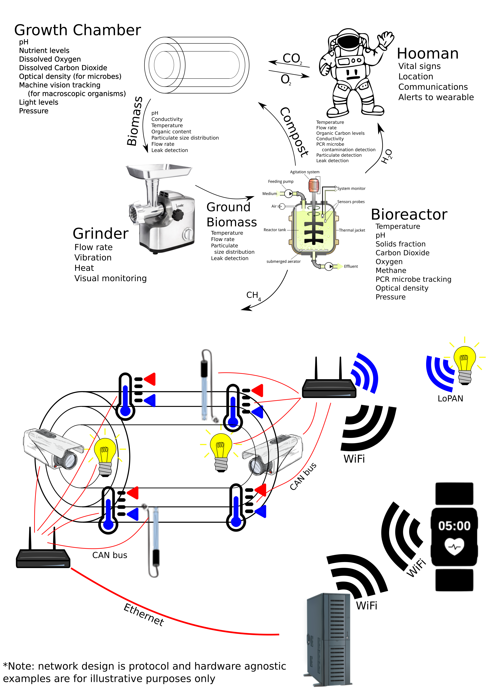
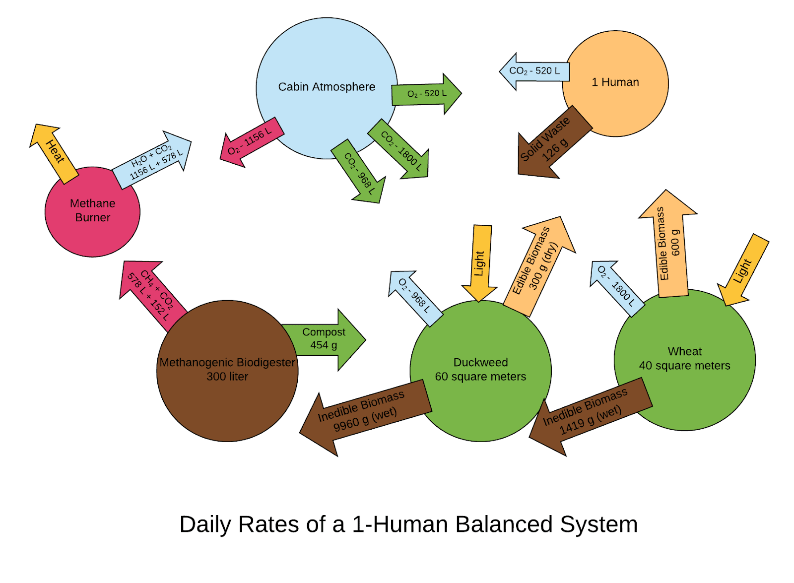

# SpaceSwamp
per putro ad astera
---
Adaptive Ecological Life Support System (AELSS) is a simple, robust, adaptable, and highly scalable Ecological Life Support System, enabling future space colonization efforts. Using just three live links, duckweed, wheat, and a biodigester, accompanied by supporting mechanisms, a system is formed that recycles nutrients continuously. Humans and higher crops can be added to or removed from the adaptive system.

Hardware Diagram:

---

Biodigester Model:
